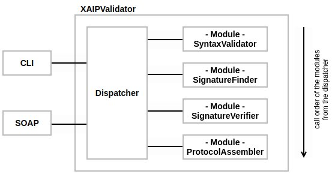

# tr-esor-AIP-eIDAS-SigValidator
The tr-esor-AIP-eIDAS-SigValidator (or short AIP-Validator) is a tool designed for validation of XML formatted Archival Information Package (XAIP) and logical XML formatted Archival Information Packge (LXAIP). Using a modular structure and plugin mechanism, the validator is validating an XAIP by using those modules which can vary by their implementation.

The master branch is supporting the newest tresor specification which is 1.3.
Versions of this tool for older specifications can be found in branches with the respective names in it.

Supported signature formats are:
- asic
- asic-aip
- cades
- pades
- xades

Validation will be done step by step in following order:

1. Dispatcher loading modules
2. Calling SyntaxModule
3. Calling SignatureFinderModule
4. Calling SignatureVerificationModule
5. Calling ProtocolAssemblerModule



## Quickstart

```
git clone https://github.com/de-bund-bsi-tr-esor/tr-esor-AIP-eIDAS-SigValidator.git

cd tr-esor-AIP-eIDAS-SigValidator

mvn clean package

java -jar aip-validator-cli/target/aip-validator-cli.jar -i ~/sample.xaip -Mvalidator.schemaDir=default-syntax-validator/src/main/resources/definitions

# CLI
# Mac/Linux/Windows
java -jar aip-validator-cli/target/aip-validator-cli.jar -i ~/sample.xaip -Mvalidator.schemaDir=default-syntax-validator/src/main/resources/definitions

# Online verification using default config for verificaionService and default schemes
java -jar aip-validator-cli/target/aip-validator-cli.jar -v -c default.conf -i ~/sample.xaip -o ~/report.xml

# SOAP Server
# Mac/Linux
java -cp "aip-validator-soap/target/aip-validator-soap-1.0.8-2.jar:aip-validator-soap/target/dependency/*" de.bund.bsi.tresor.aip.validator.soap.Server -Mvalidator.schemaDir=default-syntax-validator/src/main/resources/definitions -Mverifier.wsdlUrl="http://host:port/VerificationService/S4?wsdl"

# Windows
java -cp "aip-validator-soap/target/aip-validator-soap-1.0.8-2.jar;target/dependency/*" de.bund.bsi.tresor.aip.validator.soap.Server -Mvalidator.schemaDir=default-syntax-validator/src/main/resources/definitions -Mverifier.wsdlUrl="https://host:port/VerificationService/S4?wsdl"
```

## Prerequisites
- java 11 (>= 11.0.10)

	- for executing the CLI jar
- maven

	- to build the project and loading dependencies
	
- git-client

	- to pull this project, alternatively the project can be downloaded manually via git web

## Installation
- **Step 1:** Install Java 11

	- OpenJDK: https://openjdk.java.net/install/

- **Step 2:** Install Maven

	- Apache Maven Installation Guide: http://maven.apache.org/install.html

- **Step 3:** Install GitHub

	- GitHub installation guide: https://github.com/git-guides/install-git
	
	- GitHub GUI clients: https://git-scm.com/downloads/guis

- **Step 4:** Clone the Project

	- GitHub documentation: https://github.com/git-guides/git-clone

- **Step 5:** Build the Project

	- open up a terminal on the project root node
	
	- call `mvn clean package`

- **Optional:** Create javadoc html

	- call `mvn javadoc:aggregate -Ddoclint=none` to create the javadoc on the root node
	
	- the javadoc can be open up via `tr-esor-AIP-eIDAS-SigValidator/target/site/apidocs/index.html` (open in browser)
	
- **Use the Validator:**

	- example call:
	
```
java -jar aip-validator-cli/target/aip-validator-cli.jar -i ~/Dokumente/sample.xaip -Mvalidator.schemaDir=/tmp/tr-esor-AIP-eIDAS-SigValidator/default-syntax-validator/src/main/resources/definitions
```

### Quick Example

```
git clone https://github.com/de-bund-bsi-tr-esor/tr-esor-AIP-eIDAS-SigValidator.git

cd tr-esor-AIP-eIDAS-SigValidator

mvn clean package
mvn javadoc:aggregate -Ddoclint=none

java -jar aip-validator-cli/target/aip-validator-cli.jar -i ~/sample.xaip -Mvalidator.schemaDir=default-syntax-validator/src/main/resources/definitions


```

### Complete Example

In this example, the project was checked out under `/tmp` so the root node of the project is `/tmp/tr-esor-AIP-eIDAS-SigValidator`:

```
$ pwd
/tmp/tr-esor-AIP-eIDAS-SigValidator
```

Build the project using maven:
```
$ mvn clean package
```

A successful build should print a *`BUILD SUCCESS`* message. When following message is being printed, your shell is not using `java 11+`: *`invalid target release: 11`*. 


The tool can be found in the target directory of the *`aip-validator-cli`* submodule:
```
$ ls aip-validator-cli/target/
archive-tmp           checkstyle-checker.xml  checkstyle-rules.xml         classes            generated-test-sources  maven-status  aip-validator-cli-1.0.8-1.jar
checkstyle-cachefile  checkstyle-result.xml   checkstyle-suppressions.xml  generated-sources  maven-archiver          test-classes  aip-validator-cli.jar
```

The `jar` which can be executed does not contain version information in its name (`aip-validator-cli.jar`).
Reason for this are the required runtime dependencies. Those are being added to the versioned `jar` resulting in the `aip-validator-cli.jar`.

When executing, the first module (syntax validator) requires schema information for the aip validation.
If no specific profiles are being used, following directory can be passed to the tool to provide those schemas:

`tr-esor-AIP-eIDAS-SigValidator/default-syntax-validator/src/main/resources/definitions/`

A handy format of the javadoc can be created by calling `mvn javadoc:aggregate -Ddoclint=none` on the root project.
The javadoc will be available under `tr-esor-AIP-eIDAS-SigValidator/target/site/apidocs/index.html` which should be opened using an internet browser.

**Important Notes**

Without any additional configuration the aip validator is using the default module implementations.
For more informations take a look into the module section where the module funktionality is being further explained.

Any known issues about the validator are being explained at the bottom of this page.


## Usage
### CLI

**Description:** The cli version of the AIPValidator is being used for validation of AIP's via the command line.

**Usage:** `java -jar aip-validator.jar [OPTION [ARG]*]*`

**Options:**

```
-M=<moduleConfig>
    Passing a single module configuration property to the validator.
    The property and requirements for any module configuration properties are defined by the implementing module.

    Example: -Mverifier.wsdlUrl=http://localhost:8080/eCard?wsdl

    This example is using the property config verifier.wsdlUrl which is a required config property 
    of the DefaultVerifierModule. Instead of passing multiple module properties as an argument, a config file
    which contains the module properties can be passed instead.
    For more informations see –c, --config <file>

-c, --config <file>
    Passing a configuration file in form of a property file to the validator.
    This file can contain any module configuration property. The configuration file is being passed to every
    module so they can scan the content and retrieve any configuration properties they define. 

    The handling is just the same as passing all configuration properties via a separate command line argument.
    This argument can also be used together with single command line module property arguments.

    Example: -c config.properties

    Content of config.properties:
      validator.schemaDir=/tmp/xaip/definitions
      verifier.wsdlUrl=http://localhost:8080/eCard?wsdl

-i, --in, --input <file>
    Passing a <file> as a source for the aip validation.
    Omitting this argument will take the standard <inpuStream> for the validation.

    Example: -i /tmp/sample.xaip
	
-o, --out, --output <file>
    Defining a definition for the validation result.
    Omitting this argument will write the result to the standard <outputStream> instead.

    Example: -o /tmp/report.xml

-v, --verify
    This flags enables the signature verification which is being executed by the [SignatureVerifierModule].
    Omitting this flag will only execute the syntax validation.
    
-d, --debug
    Flag to enable debug output for a better analysis of the validator behaviour.
    This output can contain stacktraces or other kinds of errors even when everything works fine.

-l, --log <file>
    Since this tool is not only creating a report but also log output this argument can be used
    to separate the log output of the validator into a dedicated document.

    Example: -l validator.log

-h, --help
	Printing the usage of the validator.
```

### Server

**Description:** The server version of the AIPValidator is being used to provide a soap service implementing the verify function of the eCard api. This api can be used to send a verifyRequest containing an AIP which will be validated in the following steps.

**Usage:** `java -cp "target/aip-validator-soap-1.0.8-2.jar:target/dependency/*" de.bund.bsi.tresor.aip.validator.soap.Server [OPTION [ARG]*]*`

**Options:**

```	
-M=<moduleConfig>
    Passing a single module configuration property to the validator.
    The property and requirements for any module configuration properties are defined by the implementing module.

    Example: -Mverifier.wsdlUrl=http://localhost:8080/eCard?wsdl

    This example is using the property config verifier.wsdlUrl which is a required config property 
    of the DefaultVerifierModule. Instead of passing multiple module properties as an argument, a config file
    which contains the module properties can be passed instead.
    For more informations see –c, --config <file>

-c, --config <file>
    Passing a configuration file in form of a property file to the validator.
    This file can contain any module configuration property. The configuration file is being passed to every
    module so they can scan the content and retrieve any configuration properties they define. 

    The handling is just the same as passing all configuration properties via a separate command line argument.
    This argument can also be used together with single command line module property arguments.

    Example: -c config.properties

    Content of config.properties:
      validator.schemaDir=/tmp/xaip/definitions
      verifier.wsdlUrl=http://localhost:8080/eCard?wsdl

-p, --port <port>
	Port the server should be published to, 8080 by default

-P, --protocol <protocol>
	Protocol to be used, `http` by default

-H, --host <hostname>
	Hostname the server is published to

--path <path>
	Custom path the service should be used, `/aip-validate` by default
    
-d, --debug
    Flag to enable debug output for a better analysis of the validator behaviour.
    This output can contain stacktraces or other kinds of errors even when everything works fine.

-h, --help
	Printing the usage of the validator.
```

## Modules

### Default Validator

**Description:** Validating the AIP using the provided schema files (XSD's)

**Configurations:**

| ConfigName            | Example          | Description                                       |
|-----------------------|------------------|---------------------------------------------------|
| *validator.schemaDir  | /tmp/xaip-schema | schema directory containing all aip schema files |

\* - required configuration

### Default Finder

**Description:** Finding any signature in the AIP which can be in the data- or credentialSection.

**Configurations:** NONE

### Default Verifier

**Description:** Sending the found signature objects to a configured verification service and retrieving the response

**Configurations:**

| ConfigName        | Example                                                   | Description                          |
|-------------------|-----------------------------------------------------------|--------------------------------------|
| *verifier.wsdlUrl | https://host:port/VerificationService/S4?wsdl             | url of the verification service wsdl |

\* - required configuration


### Default Assembler

**Description:** Merging all results into one report

**Configurations:** NONE

## Known Issues and Limitations

The following limitations apply:

- The processing of XAdES-compliant signature objects is currently not fully supported. This issue will be fixed in one of the next SNAPSHOT releases
- Information for `TransformInfoType` is currently not generated due to inconsistencies in the verification report scheme
- Extensions are not evaluated due to their dependency to specific profiles
- The content of Metadata sections is not evaluated with the exception of their well-formedness

The following issues are known:
- **[XVAL-1]** When using the paramter `-o` the provided argument has to be a file which is not in the current directory

## Test Environment ##

- Use the following URL for the validation service: https://tresortest.protectr.de/VerificationService/eCard?wsdl
- Some test material can be found in aip-validator-cli/src/test/resources/samples

## License ##

This software is underlying the rules of the following license: Apache License Version 2.0, January 2004.\
The software was created by procilon IT-Logistics GmbH on behalf of the Federal Office for Information Security.

## Contact ##

**Federal Office for Information Security (BSI)**\
Godesberger Allee 185-189\
53175 Bonn, Germany\
phone: +49 228 99 9582-0\
fax: +49 228 99 9582-5400\
e-mail: tresor@bsi.bund.de

and

**procilon IT-Logistics GmbH**\
Leipziger Straße 110\
04425 Taucha bei Leipzig, Germany\
phone: +49 34298 4878 31\
e-mail: anfrage@procilon.de

## Changelog ##
### Default Validator ###

- 1.0.0
	- inital version

### Default Finder ###

- 1.0.0
	- inital version
- 1.1.0
	- added ASiC support

### Default Verifier ###

- 1.0.0
	- inital version
- 1.1.0
	- proper usage of eCard API
	- adding local xPath informations when disabling the verification

### Default Assembler ###

- 1.0.0
	- inital version
